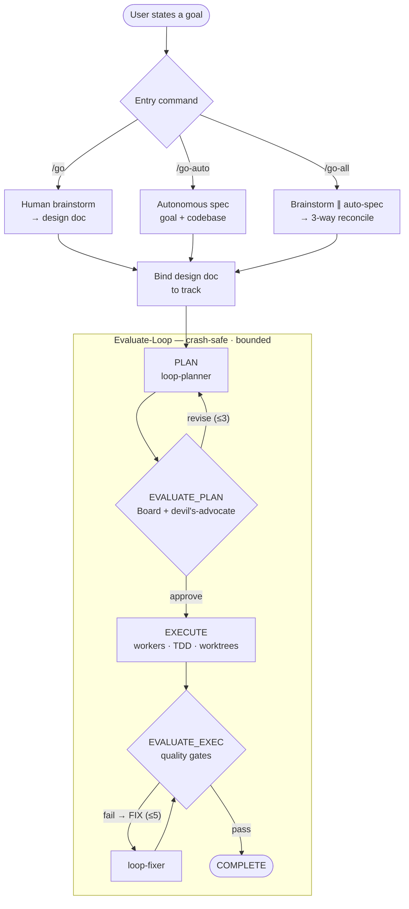
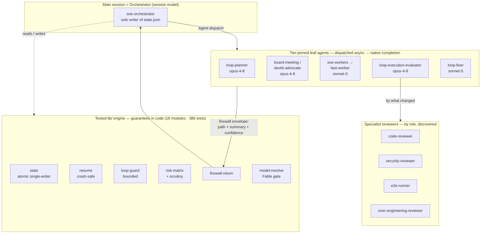

<h1 align="center">soe</h1>

<p align="center">
  <em>Disciplined intent → plan → TDD → verify — driven autonomously by a crash-safe, human-debuggable engine that uses the best installed specialist for every job.</em>
</p>

---

**soe** fuses three things into one Claude Code plugin:

- the **Superpowers 6.1.1 discipline pipeline** (brainstorm → plan → TDD → verify),
- a **simplified, *tested* multi-agent orchestration engine** — the *Evaluate-Loop*, adapted from Conductor (parallel workers, Board of Directors, quality gates, bounded loops) with every integrity-critical decision as **real code, not prose in a prompt**,
- and the **best of Everything Claude Code** (instincts, logging, self-audit) — plus **session-model-led multi-model orchestration**, **token-efficient cross-plugin discovery**, and a **minimal-code** discipline.

> **45 skills · 22 agents · 16 commands · 15 tested `lib/` modules · 340 passing tests.**

## Features

- **One engine, three front doors** — `/go` (human brainstorm), `/go-auto` (autonomous spec), `/go-all` (dual derivation + reconciliation) all feed one autonomous **Evaluate-Loop**.
- **Real multi-agent orchestration** — the session model *is* the orchestrator; it dispatches tier-pinned leaf agents (planner, board, workers, evaluator, fixer) **asynchronously** and collects each **native completion** (no polling), applying results serially as the sole state writer.
- **Session-model-led multi-model tiering** — agents pinned to latest **full model IDs** (`claude-opus-4-8` reasoning · `claude-sonnet-5` mechanical · `claude-fable-5` top-stakes · `claude-haiku-4-5` cheap), with a **config Fable gate** (`fable_enabled:false` → falls back to Opus).
- **Board of Directors + devil's-advocate** — a cheap collapsed 5-lens board by default, a full 5-director vote for high-stakes, and an adversarial red-team gate before any plan executes.
- **Guarantees in code, not prompts** — 15 tested `lib/` modules: atomic single-writer state, crash-safe idempotent resume, bounded fix/plan loops, a deterministic **risk matrix + fail-safe scrutiny** (only ever *raises*), a **context-firewall** validator, and the model resolver.
- **Context firewall** — delegated agents return only `path + 3-line summary + confidence`; full output stays out of the orchestrator's context.
- **Worktree-isolated workers, mandatory TDD** — parallel workers can't trample; every change is RED → GREEN → REFACTOR.
- **Token-frugal by design** — lean core (language depth from installed packs), collapsed-vs-full board by stakes, and an always-on **minimal-code** discipline (shortest working diff; code only).
- **Cross-plugin capability discovery** — auto-detects and reuses installed skills / agents / MCP servers (graphify, chrome-devtools, Codex, Figma) by role, degrading gracefully when absent.
- **Escalation that learns** — escalates only genuine judgment calls or irreversible actions, and learns from each so routine interruptions fade.
- **Ambient, no ceremony** — `/simplify`, `/critique`, `/self-audit`, `/logging` and the discipline skills all work standalone.

## What This Project Provides

**One engine, three front doors.** A single autonomous loop (`PLAN → EVALUATE_PLAN → EXECUTE → EVALUATE_EXEC → (FIX↺ | COMPLETE)`) fronted by three entry commands that differ only in how the spec is derived:

| Command | How the spec is derived |
|---|---|
| `/go <goal>` | **Human-in-the-loop brainstorm** first (aligns intent, cuts hallucination), then the loop |
| `/go-auto <goal>` | **Autonomous** spec from goal + codebase, then the loop |
| `/go-all <goal>` | Brainstorm **∥** an *independent* background auto-spec → **3-way reconciliation** (you decide) → the loop |

**Real, not fictional.** The reliability-critical machinery is tested Node code: atomic + single-writer state store, crash-safe resume with idempotency, bounded fix/plan loops, a deterministic risk matrix + fail-safe scrutiny, a context-firewall validator. Prompt-following handles the *reasoning*; code handles the *guarantees*.

**Token-frugal by design.** Lean core (language depth comes from installed plugins, not a monolith), context firewall on delegated work, collapsed-vs-full Board by stakes, and an always-on **minimal-code** discipline (write the shortest working diff — code only, never docs, never on high-stakes shortcuts).

## How It Works

You state a goal with `/go`. Instead of guessing, the agent first sits down with you and **brainstorms the intent** — teasing a design out of the conversation, showing it back in digestible chunks, and binding an approved design doc to the track. (Already brainstormed? It skips straight to planning. Want it fully autonomous? Use `/go-auto`. Want both derivations cross-checked? `/go-all`.)

Then the **Evaluate-Loop** takes over. `loop-planner` writes a phased plan + dependency DAG using the `writing-plans` discipline. The **Board of Directors** reviews the plan (a cheap single-pass 5-lens review by default; a full 5-persona vote for high-stakes changes), and a **devil's-advocate** gate red-teams it against the design. Approved, it **executes tasks as parallel workers in isolated git worktrees** — each following mandatory TDD — while the orchestrator, the *sole writer* of state, applies their validated results serially. `EVALUATE_EXEC` runs the right evaluators for what changed (code quality, integration, security, over-engineering, E2E); failures loop back through a **bounded** `FIX` (max 5). Crash mid-run? It resumes from the single source of truth and never re-runs finished work.

It escalates only genuine judgment calls or irreversible actions — and **learns from each escalation**, so routine interruptions fade over time. Everything durable (specs, plans, decisions, learned patterns) lives in `docs/plans/` + `.soe/`, committed and shareable; transient run-state is ignored.

**Prefer no ceremony?** Every piece works ambient, no `/go` needed: run `/soe:simplify` on a diff, `/soe:critique` on a design, `/soe:self-audit` on the plugin, or invoke the discipline skills directly.

## Installation

### Quick Install (Recommended)

In Claude Code:

```bash
# 1. Register the marketplace
/plugin marketplace add FaisalAlqarni/soe

# 2. Install the plugin
/plugin install soe@soe-marketplace
```

Then restart Claude Code.

### Manual Installation (Alternative)

**1. Clone:**
```bash
git clone https://github.com/FaisalAlqarni/soe
cd soe
```

**2. Symlink into the Claude Code plugins directory:**

**macOS/Linux:**
```bash
ln -s "$(pwd)" ~/.claude/plugins/soe
```

**Windows:**
```bash
mklink /D "%USERPROFILE%\.claude\plugins\soe" "C:\path\to\soe"
```

**3. Restart Claude Code.**

### First run

```bash
/setup                                  # scaffold the .soe/ state layer for this project
/go Add Stripe payment integration      # brainstorm → plan → execute → verify, autonomously
```

### Verify Installation

- Ask *"help me plan this feature"* → should trigger `soe:brainstorming`.
- Type `/soe:go` → should show the entry command.
- Run `/soe:self-audit` → should run soe's own validity + reference + security checks.

### Updating

```bash
/plugin update soe            # if installed via marketplace
# or, manual:
cd /path/to/soe && git pull
```

### Optional companions (discovered, never required)

soe auto-detects and uses these if installed, and degrades gracefully if not:

- **[graphify](https://github.com/safishamsi/graphify)** — code knowledge-graph for token-efficient retrieval **and** real dependency blast-radius in the risk matrix.
- **chrome-devtools-mcp** — browser E2E (network/console/perf/Lighthouse) for the `e2e-runner`; falls back to Playwright, skips if absent.
- **OpenAI Codex plugin** — a different-perspective peer for high-stakes parallel synthesis.
- **ECC / `soe-extras`** — language-depth packs; their specialist reviewers are preferred by role, with soe-core generics as fallback.

## Architecture

### High level — how a goal becomes verified code



### Low level — components & dispatch

The **main session is the orchestrator**: it dispatches tier-pinned leaf agents asynchronously, collects each **native completion** (never a poll), validates every return through the **context firewall**, and is the **sole writer** of `state.json`. Integrity-critical decisions live in tested `lib/` code.



**The loop, phase by phase:**

- **PLAN** — `loop-planner` (opus) writes the plan+DAG following `writing-plans`.
- **EVALUATE_PLAN** — collapsed Board by default; full Board + adversarial `devils-advocate` for high-stakes (selected by the deterministic risk matrix, never ad hoc).
- **EXECUTE** — workers in isolated worktrees, mandatory TDD, results validated by the context firewall and applied serially by the sole state writer.
- **EVALUATE_EXEC** — the evaluator dispatches the right lenses for what changed; over-engineering + E2E + observability checks run when relevant.
- **COMPLETE** — gated in code: a track reaches `COMPLETE` only via `completeTrack()`, which requires an **independent, non-author evaluator PASS whose report exists on disk** (`lib/provenance.js`) — self-certification is rejected. `full`-tier tracks also need a Board decision of `APPROVED`/`APPROVED_WITH_REVIEW` (`lib/board-gate.js`), with board rejections bounded. Sensitive-path edits and board `ESCALATE` route through graduated HITL (`lib/hitl.js`) per interaction mode.
- **FIX** — bounded loop-back; at the cap it finishes `completed-with-warnings` rather than spinning.

### The Board of Directors

`EVALUATE_PLAN` runs a panel of **5 independent expert directors**, each a C-suite persona contributing one lens (full personas in `skills/board-of-directors/directors/chief-*.md`):

| Director | Domain | Evaluates |
|---|---|---|
| **CA** — Chief Architect | Technical | System design, patterns, scalability, tech debt, code quality |
| **CPO** — Chief Product Officer | Product | User value, market fit, scope, prioritization, usability |
| **CSO** — Chief Security Officer | Security | Vulnerabilities, compliance, data protection, risk |
| **COO** — Chief Operations Officer | Operations | Feasibility, timeline, resources, deployment |
| **CXO** — Chief Experience Officer | Experience | UX/UI, accessibility, user journey, design consistency |

- **Collapsed board (default)** — one model call emits all 5 lenses + an overall decision as a single JSON object; `lib/board-verdict.js` `parseCollapsed` validates it and rejects a malformed board.
- **Full board (high-stakes)** — the `board-meeting` agent dispatches all 5 directors as **independent parallel subagents**; `aggregateFull` tallies their approve/reject votes into a resolution. Then a `devils-advocate` gate red-teams the plan against the design before any code runs.

## What's Inside

**Discipline pipeline** (Superpowers 6.1.1): `brainstorming`, `writing-plans`, `executing-plans`, `subagent-driven-development`, `test-driven-development`, `systematic-debugging`, `verification-before-completion`, `using-git-worktrees`, `finishing-a-development-branch`, `requesting/receiving-code-review`, `writing-skills`, `dispatching-parallel-agents`.

**Engine agents:** `soe-orchestrator`, `loop-planner`, `soe-workers` (`fast-worker`), `loop-execution-evaluator`, `loop-fixer`, `board-meeting`, `devils-advocate`.

**Multi-model role agents:** `strategist` (fable), `deep-reasoner` (opus), `fast-worker` (sonnet).

**Specialist agents:** `code-reviewer`, `security-reviewer`, `architect`, `tdd-guide`, `build-error-resolver`, `refactor-cleaner`, `doc-updater`, `e2e-runner`, `database-reviewer`, `logging-reviewer`, `over-engineering-reviewer` / `over-engineering-auditor`.

**Commands** (`/soe:*`):
```
/go  /go-auto  /go-all   Entry points (brainstorm / autonomous / dual cross-check)
/setup                   Scaffold the .soe/ state layer
/critique                Adversarial design/plan review (devil's advocate)
/simplify  /over-eng-audit   Minimal-code lens (diff / repo), on demand
/self-audit              soe reviews itself (validity + refs + AgentShield)
/logging                 Wide-events logging audit/refactor
/learn  /learn-eval  /evolve  /instinct-*   The continuous-learning / instinct system
/skill-create
```

**Tested `lib/` engine (18 modules):** `state` (atomic + single-writer lock + the `completeTrack` completion gate), `provenance` (non-author-evaluator completion invariant), `resume` (crash-safe + idempotency), `loop-guard` (bounded loops incl. board-reject cap), `risk-matrix` + `scrutiny` (deterministic fail-safe), `escalation` (irreversible-always-confirm), `model-resolve` (tier → full model ID + Fable gate), `board-verdict` + `board-gate` (verdict engine + completion-gate decision), `hitl` (sensitive-path + file-backed approval), `firewall-return`, `capability-scan`, `mcp-discovery`, `codex-detect`, `gitignore-manager`, `setup`, `skills-core`.

**Hooks:** SessionStart bootstrap, PreToolUse destructive-git guard, PostToolUse formatting, learning-eval, compaction nudges.

**Rules** (`rules/common/`): always-on baselines for coding-style, model-routing, agents, testing, security, logging, performance, git-workflow, hooks, patterns, clarify-first, workflow-orchestration — compiled into the skills that need them.

## Multi-Model Orchestration

The model you pick with `/model` **is** the orchestrator; it dispatches tier-pinned leaf agents and self-selects a topology. Agents pin **latest full model IDs** (not aliases — the bare `sonnet` alias lags to `claude-sonnet-4-6`):

| Tier | Model ID | Role |
|---|---|---|
| reasoning | `claude-opus-4-8` | `deep-reasoner`, planner, board, evaluator |
| mechanical | `claude-sonnet-5` | `fast-worker`, executor, fixer |
| top-stakes | `claude-fable-5` | `strategist` — hardest, irreversible judgment |
| cheap | `claude-haiku-4-5` | ad-hoc low-cost work |

- **On Fable** → Fable orchestrates → `deep-reasoner` for reasoning, `fast-worker` for mechanical (no `strategist` — already the top tier).
- **On Opus** → Opus orchestrates → `fast-worker` for mechanical; `strategist` only for top-stakes.
- **On Sonnet** → Sonnet orchestrates → `deep-reasoner` for reasoning.

**Fable gate:** availability (skipped if the user isn't on Fable) **and** config — `.soe/config.json` `fable_enabled:false` routes the strategist tier to Opus (`lib/model-resolve.js`) to cap Fable spend. Dispatch is **async → native completion** (never a poll), and a **context firewall** keeps the orchestrator lean (delegates return `path + 3-line summary + confidence`). See `skills/model-orchestration/SKILL.md`.

## Minimal-Code Discipline

Adapted from [ponytail](https://github.com/DietrichGebert/ponytail): implementation workers write the **shortest working, understood diff** (reuse → stdlib → native → minimal), with intensity scaled by risk (trivial → ultra, high-stakes → lite + guardrails). Strictly **code-only** (never minimizes docs) and **implementation-only** (never dulls reviewers/security). An advisory `over-engineering-reviewer` lens hunts reducible code; run it on demand with `/soe:simplify`.

## Philosophy

- **Integrity first, then simplicity, then tokens** — never trade correctness or safety for brevity.
- **Guarantees in code, reasoning in prompts** — the loop's invariants are tested, not asserted.
- **Human-debuggable** — plain markdown + small tested libs; a human can read and trace it.
- **Test-Driven** — RED → GREEN → REFACTOR, always.
- **Token-frugal** — lean core, context firewall, right-sized ceremony.
- **Graceful, never hard-depend** — discover and use what's installed; fall back cleanly.

## Documentation

- [`docs/USAGE.md`](docs/USAGE.md) — day-to-day use, ambient commands, the manual discipline pipeline.
- [`docs/ARCHITECTURE.md`](docs/ARCHITECTURE.md) — the engine, the `lib/` modules, gates, discovery, multi-model, multi-harness (the human-debuggability reference).
- [`docs/MIGRATION.md`](docs/MIGRATION.md) — clean-break migration from `sp-ecc`.
