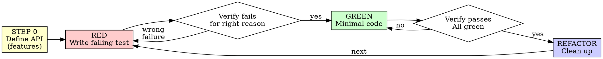

# Test-Driven Development (TDD)

> Gate type: **verification** (always autonomous — see `soe:gate-classification`).

Write the test first. Watch it fail. Write minimal code to pass.

**Core principle:** If you didn't watch the test fail, you don't know if it tests the right thing.

**Violating the letter of the rules is violating the spirit of the rules.**

## The Iron Law

```
NO PRODUCTION CODE WITHOUT A FAILING TEST FIRST
```

Wrote code before the test? Delete it. Start over. No exceptions:
- Don't keep it as "reference", don't "adapt" it, don't look at it.
- Delete means delete. Implement fresh from tests.

## When to Use

**Always:** new features, bug fixes, refactoring, behavior changes.

**Exceptions (ask your human partner):** throwaway prototypes, generated code, config files.

Thinking "skip TDD just this once"? Stop. That's rationalization.

## Red-Green-Refactor



### Step 0 — Define the API (features only)

For a new feature, before writing tests, pin down what you're building so RED fails for the *right* reason:

1. One-line user story: `As a [role], I want [action], so that [benefit]`.
2. Typed stubs: function signatures with parameter/return types, body throwing `Not implemented` (or language equivalent).

This makes RED fail because the behavior is missing — not because of a type error or typo.

Skip Step 0 for bug fixes — go straight to RED with a test reproducing the bug.

### RED — Write a failing test

Write **one** minimal test showing what should happen. One behavior, clear name, real code (no mocks unless unavoidable).

```typescript
test('retries failed operations 3 times', async () => {
  let attempts = 0;
  const operation = () => { attempts++; if (attempts < 3) throw new Error('fail'); return 'success'; };
  const result = await retryOperation(operation);
  expect(result).toBe('success');
  expect(attempts).toBe(3);
});
```

### Verify RED — watch it fail (MANDATORY, never skip)

First **detect the test runner** — don't assume `npm test` (see reference.md). Then run the new test and confirm a valid RED:

- **Runtime RED:** the test compiles, is actually executed, and fails.
- **Compile-time RED:** the new test references code that doesn't exist yet, so it fails to compile — that compile failure *is* the intended RED signal.
- Either way the failure must be caused by the missing/buggy behavior — **not** by unrelated syntax errors, broken setup, or missing deps.

A test that was written but never compiled and executed does **not** count as RED.

**Test passes?** You're testing existing behavior — fix the test. **Test errors for the wrong reason?** Fix it, re-run until it fails correctly.

### GREEN — minimal code

Write the simplest code that passes. Don't add features, refactor other code, or "improve" beyond the test (YAGNI). Then re-run the same test target and confirm it's GREEN, other tests still pass, and output is pristine (no errors/warnings). **Test fails? Fix code, not test.**

### REFACTOR — clean up (only after green)

Remove duplication, improve names, extract helpers. Keep tests green; don't add behavior. Then loop to the next failing test.

## Coverage

- **80% minimum** for all code.
- **100%** for authentication, payment, and security-critical paths.
- Coverage is a guide, not a goal — high coverage + poor tests = false confidence. See reference.md for tiers, focus areas, and what not to obsess over.

## Debugging Integration

Bug found? Write a failing test reproducing it, then follow the cycle. The test proves the fix and prevents regression. Never fix bugs without a test.

## Red Flags — STOP and start over

Code before test · test after implementation · test passes immediately · can't explain why it failed · tests added "later" · "already manually tested" · "keep as reference" · "deleting X hours is wasteful" · "TDD is dogmatic, I'm being pragmatic" · "this is different because…"

**All of these mean: delete the code, start over with TDD.**

## Verification Checklist

- [ ] Every new function/method has a test
- [ ] Watched each test fail (valid RED) before implementing
- [ ] Each test failed for the expected reason (behavior missing, not typo)
- [ ] Wrote minimal code to pass
- [ ] All tests pass; output pristine
- [ ] Tests use real code (mocks only if unavoidable); edge cases and errors covered

Can't check every box? You skipped TDD. Start over.

## Final Rule

```
Production code → a test exists and failed first
Otherwise → not TDD
```

No exceptions without your human partner's permission.

## Reference

- **[reference.md](reference.md)** — test-runner detection, common test mistakes, coverage tiers, rationalizations table, "why order matters", when-stuck guide, and the TDD evidence report format (what to report to prove red-then-green happened).
- **[testing-anti-patterns.md](testing-anti-patterns.md)** — read when adding mocks or test utilities: testing mock behavior, test-only methods on production classes, mocking without understanding dependencies.
